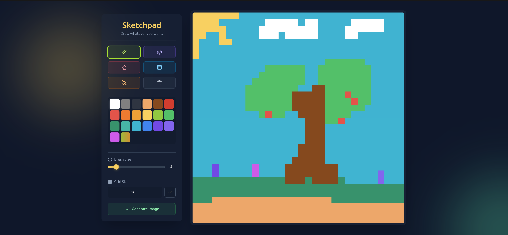

# Sketchpad


A modern, responsive drawing application built from scratch. This project is a complete refactor of a classic vanilla JavaScript sketchpad, enhanced with a modern tech stack and a polished, animated user interface.



---

## 🚀 Live Demo

**[Click here to start drawing!](https://ericpastorm.github.io/sketchpad/)**

## ✨ Features

-   ✏️ **Pencil & Eraser Tools:** Draw and erase with an adjustable brush size.
-   🎨 **Rich Color Palette:** A wide selection of curated colors, plus a dynamic random color option.
-   💧 **Paint Bucket:** Fill the entire canvas with the selected color in a single click.
-   🖼️ **Adjustable Canvas:** Resize the grid from 1x1 up to 100x100 pixels.
-   🌐 **Toggle Grid Lines:** Show or hide the grid for better guidance.
-   📥 **Export to PNG:** Save your creations as a high-quality PNG image.
-   📱 **Fully Responsive:** A seamless experience on desktop, tablet, and mobile devices.
-   ✨ **Modern UI:** A sleek, dark-themed interface with glassmorphism effects, custom cursors, and smooth animations.

## 🛠️ Tech Stack

-   **Vite:** Next-generation frontend tooling for a fast development experience.
-   **Tailwind CSS:** A utility-first CSS framework for rapid and responsive UI development.
-   **JavaScript (ES6+):** Modern, clean, and modular vanilla JS to handle all the application logic.
-   **Lucide Icons:** Beautiful and consistent open-source icons.
-   **dom-to-image-more:** A powerful library to export DOM nodes as images.

## 🏁 Getting Started

To run this project locally, follow these steps:

1.  **Clone the repository:**
    ```bash
    git clone [https://github.com/ericpastorm/sketchpad](https://github.com/ericpastorm/sketchpad)
    ```

2.  **Navigate to the project directory:**
    ```bash
    cd sketchpad
    ```

3.  **Install dependencies:**
    ```bash
    npm install
    ```

4.  **Run the development server:**
    ```bash
    npm run dev
    ```
    The application will be available at `http://localhost:5173`.

## 📄 License

This project is licensed under the MIT License. See the [LICENSE](LICENSE) file for details.